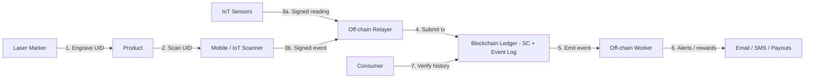
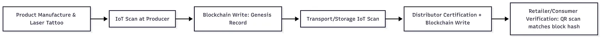

### **Blockchain-Based Supply-Chain Certification Using Laser Marking and Tokenization**

#### **Motivation**

Supply chains for ecological or fair-trade goods (e.g., organic foods, luxury goods) are vulnerable to fraud and greenwashing. Traditional certification methods like barcodes and stickers can be easily forged or swapped. **Laser marking** (Direct Part Marking, DPM) offers an indelible physical identifier; when combined with Distributed Ledger Technology (DLT), it provides a strong digital-physical link for certification claims.

> **Scope note on physical marks.** For hard goods (metal, glass, hardwood, leather), a laser can engrave a per-item Unique Identifier (UID) that survives the supply chain. For soft produce (fruit, vegetables), low-energy "natural branding" marks the skin/rind but is typically **batch-level**, not per-item — and many marks (paper labels, ink) remain forgeable. The design below treats per-item UIDs as the default and explicitly handles batch-level marks where per-item engraving is impractical.

#### **Proposed Architecture**

* **Product Marking:** A high-precision laser marks a UID directly onto the product or its primary packaging. Where per-item marking is impractical (e.g., produce), the mark identifies a batch and is bound to a `BatchToken` instead of an `ItemToken`.
* **Ledger Storage:** Each UID is tokenized — `ItemToken` (ERC-721) for per-item, `BatchToken` (ERC-1155) for lots. Token state holds slowly-changing facts (origin, certification IDs); per-event data (location, custody, conditions) is recorded as signed on-chain events keyed to the tokenId. Heavy artifacts (PDF certificates, sensor logs) live off-chain and are referenced by content hash (CID).
* **IoT & Oracles:** Mobile devices and IoT sensors scan the mark at supply-chain checkpoints. Each reading is signed by the device key and submitted by an off-chain relayer; the smart contract verifies the signature against the participant Registry before accepting the event.
* **Consumer Verification:** End-users scan the mark to retrieve the public history and verify ecological claims; the verify endpoint walks the event chain and checks every signature.

#### **Key Architecture Features**

* **Physical Identifier:** Indelible laser-engraved UID prevents label swapping on hard goods; batch marks are bound to a `BatchToken` with explicit split/merge semantics for produce and other commodities.
* **IoT Integration:** Automated capture at handoffs reduces human error. Sensors that hold a secure element (TPM, NFC SE, or ATECC608A-class chip) sign measurements before upload; sensors without secure storage submit measurements via a trusted gateway that signs on their behalf, and this distinction is recorded on the event.
* **Blockchain Layer:** A public or permissioned ledger (e.g., Hyperledger Fabric for consortium use, Polygon / VeChainThor for public auditability) acts as the authoritative event log; identifiers and event payloads follow GS1 EPCIS 2.0 vocabulary where applicable.
* **Smart Contracts:** Enforce token-level invariants (one mint per UID; only the registered custodian can transfer; conservation of mass on batch split/merge) and **emit events** that off-chain workers consume to dispatch external alerts (temperature breach, geofence violation) and to compute producer rewards.

#### **Data and Privacy**

* **Zero-Knowledge Proofs (ZKP):** Enables "selective disclosure." For example, a retailer can verify a product is "Fair Trade Certified" without the supplier revealing their wholesale pricing or exact farm location to competitors.
* **Off-Chain Storage:** Heavy documents (PDF certificates, lab reports) are stored on IPFS or cloud storage, linked to the blockchain via cryptographic hash pointers to maintain ledger efficiency.

#### **Ecological and Business Impact**

* **Traceability:** Industry pilots commonly report large gains in checkpoint visibility and verification speed once paper certificates are replaced by signed digital events — exact figures vary by sector and baseline and should be measured per deployment rather than asserted as universal.
* **Brand Trust:** Consumer-survey evidence (e.g., NielsenIQ, IBM Institute for Business Value) consistently shows a majority of shoppers favour brands that publish verifiable sourcing data; treat any single percentage as indicative, not normative.
* **Carbon Tracking:** Granular logging of transport distances and storage conditions enables product-level carbon-footprint calculations aligned with the GHG Protocol Product Standard and supports CSRD/CBAM reporting.

#### **Data Flow Architecture**

```mermaid
graph LR
    Laser[Laser Marker] -->|1. Engrave UID| Product
    Product -->|2. Scan UID| App[Mobile / IoT Scanner]
    Oracle[IoT Sensors] -->|3a. Signed reading| Relayer[Off-chain Relayer]
    App -->|3b. Signed event| Relayer
    Relayer -->|4. Submit tx| DLT[Blockchain Ledger - SC + Event Log]
    DLT -->|5. Emit event| Worker[Off-chain Worker]
    Worker -->|6. Alerts / rewards| External[Email / SMS / Payouts]
    Consumer -->|7. Verify history| DLT
```

#### **Sustainability and Compliance Impact**

* **Waste Reduction:** Eliminates the need for paper certificates and plastic stickers.
* **Anti-Greenwashing:** Provides mathematically verifiable proof of claims.
* **Audit Trails:** DLT ensures records are tamper-resistant, simplifying regulatory audits.
* **Dynamic Metrics:** Enables per-item tracking of carbon, water usage, and ethical labor standards.

#### **Real-World Innovations & Ledger Suitability**

* **Ethereum (Layer 2) / Polygon:** Best for public auditability and consumer access via standard wallets.
* **VeChain / Algorand:** High throughput and low energy costs; ideal for high-volume FMCG (Fast-Moving Consumer Goods).
* **Hyperledger Fabric:** Suitable for private, enterprise-only supply chain consortia requiring strict data privacy.

**References:**

* [GS1 EPCIS 2.0 — event-based traceability standard](https://www.gs1.org/standards/epcis)
* [GS1 Digital Link — URI syntax for product identifiers](https://www.gs1.org/standards/gs1-digital-link)
* [GHG Protocol — Product Life Cycle Accounting and Reporting Standard](https://ghgprotocol.org/product-standard)
* [EU Corporate Sustainability Reporting Directive (CSRD)](https://finance.ec.europa.eu/capital-markets-union-and-financial-markets/company-reporting-and-auditing/company-reporting/corporate-sustainability-reporting_en)
* [EU Carbon Border Adjustment Mechanism (CBAM)](https://taxation-customs.ec.europa.eu/carbon-border-adjustment-mechanism_en)

#### **Sustainability-First Consensus (SFC) Compliance**

This project conforms to the [Sustainability-First Consensus profile v1.1](../SFC_COMPLIANCE.md) applying the framework defined in Besleaga (2026), [doi:10.1145/3809296](https://doi.org/10.1145/3809296) *(in press)*, [ORCID 0009-0001-3464-5283](https://orcid.org/0009-0001-3464-5283):

* **Energy (criterion 1).** Hot path on **Hyperledger Fabric** or **VeChainThor**; daily Merkle anchor on **Polygon zkEVM**. Combined measured energy budget < **1 GWh / yr** network-wide.
* **Hardware lifecycle (criterion 2).** General-purpose servers only; no ASICs; reuse / WEEE-certified recycling policy in every operator's Registry record.
* **Carbon accountability (criterion 3).** Monthly `EnergyAttested` + `CarbonAttested` events (CCRI methodology + Electricity Maps grid intensity). Net Zero enforced per period.
* **Regulatory readiness (criterion 4).** `/v1/sustainability/csrd` returns signed ESRS E1 disclosures for CSRD reporting.

#### **Companion Documents**

* [PRD.md](PRD.md) — Product Requirements.
* [SPEC.md](SPEC.md) — Technical Specification (tokens, events, APIs, marking rules).
* [ARCH.md](ARCH.md) — Architecture (components, trust boundaries, deployment).
* [../SFC_COMPLIANCE.md](../SFC_COMPLIANCE.md) — Shared Sustainability-First Consensus profile.

---
