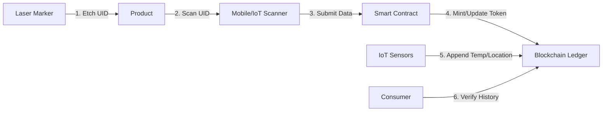

### **Blockchain-Based Supply-Chain Certification Using Laser Marking and Tokenization**

#### **Motivation**

Supply chains for ecological or fair-trade goods (e.g., organic foods, luxury goods) are vulnerable to fraud and greenwashing. Traditional certification methods like barcodes and stickers can be easily forged or swapped. **Laser marking** (Direct Part Marking) offers an indelible physical identifier; when combined with Distributed Ledger Technology (DLT), it provides an irrefutable, digital-physical link for certification.

#### **Proposed Architecture**

* **Product Marking:** A high-precision laser marks a Unique Identifier (UID) directly onto the product (e.g., fruit skin etching) or packaging.
* **Ledger Storage:** The UID is tokenized as an NFT (e.g., ERC-721) containing immutable metadata: certifications (organic, fair trade), origin, and transport milestones.
* **IoT & Oracles:** Mobile devices and IoT sensors scan the mark at supply chain checkpoints. Smart contracts automatically append events (location, timestamps) and environmental data (temperature, humidity) to the token.
* **Consumer Verification:** End-users scan the mark to instantly retrieve the immutable product history and verify ecological claims.

#### **Key Architecture Features**

* **Physical Identifier:** Indelible laser-engraved UID prevents label swapping.
* **IoT Integration:** Automated data capture at handoffs reduces human error. Sensors sign data cryptographically before uploading.
* **Blockchain Layer:** A public or permissioned ledger (e.g., VeChainThor, Hyperledger Fabric) serves as the "single source of truth," recording timestamped geodata and custody changes.
* **Smart Contracts:** Automatically enforce compliance standards (ESG, Circular Economy). They can trigger alerts for temperature breaches or issue rewards to responsible producers.

#### **Data and Privacy**

* **Zero-Knowledge Proofs (ZKP):** Enables "selective disclosure." For example, a retailer can verify a product is "Fair Trade Certified" without the supplier revealing their wholesale pricing or exact farm location to competitors.
* **Off-Chain Storage:** Heavy documents (PDF certificates, lab reports) are stored on IPFS or cloud storage, linked to the blockchain via cryptographic hash pointers to maintain ledger efficiency.

#### **Ecological and Business Impact**

* **Traceability:** Organizations report >80% improved visibility and a 90% reduction in verification time.
* **Brand Trust:** Over 67% of consumers prefer brands with transparent sourcing.
* **Carbon Tracking:** Granular logging of transport distances and storage conditions allows for automated, accurate Carbon Footprint calculations (supporting CSRD/CBAM compliance).

#### **Data Flow Architecture**

#### **Sustainability and Compliance Impact**

* **Waste Reduction:** Eliminates the need for paper certificates and plastic stickers.
* **Anti-Greenwashing:** Provides mathematically verifiable proof of claims.
* **Audit Trails:** DLT ensures records are tamper-resistant, simplifying regulatory audits.
* **Dynamic Metrics:** Enables per-item tracking of carbon, water usage, and ethical labor standards.

#### **Real-World Innovations & Ledger Suitability**

* **Ethereum (Layer 2) / Polygon:** Best for public auditability and consumer access via standard wallets.
* **VeChain / Algorand:** High throughput and low energy costs; ideal for high-volume FMCG (Fast-Moving Consumer Goods).
* **Hyperledger Fabric:** Suitable for private, enterprise-only supply chain consortia requiring strict data privacy.

**References:**

* [Certified Blockchain & Supply Chain Professional Training (Blockchain Council)](https://www.blockchain-council.org/certifications/certified-blockchain-supply-chain-expert/)
* [Case Study: Blockchain Supply Chain for ESG Compliance](https://www.blockchainappsdeveloper.com/case-study-blockchain-supply-chain-tracking-solution)

---
