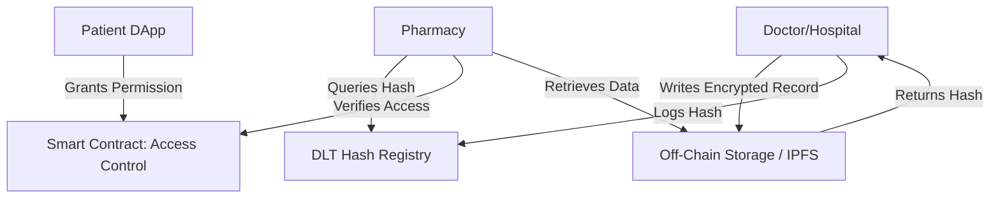

### **Blockchain in Healthcare: Prescriptions, Patient Records, and Pharmacy Interchange**

#### **Motivation**

Current centralized or paper-based healthcare systems suffer from data fragmentation, security vulnerabilities, and a lack of interoperability between providers. This leads to privacy risks, administrative inefficiencies, and resource waste. Furthermore, prescription fraud and the infiltration of counterfeit drugs into the supply chain pose severe risks to public health.

#### **Proposed Architecture**

* **Core Technologies:**
* **Smart Contract Platform:** Permissioned ledgers (e.g., Hyperledger Fabric, Corda) for privacy compliance, or Layer-2 solutions (Polygon) for verification.
* **Off-Chain Storage:** IPFS or decentralized databases for encrypted document storage (keeping heavy data off the main chain).
* **Identity Management:** Self-Sovereign Identity (SSI) using Verifiable Credentials (VC) and Decentralized Identifiers (DID) for patients and providers.

* **Workflow:**
* **Access Control:** Patients control their own data via a DApp; hospitals and pharmacies are authenticated via VCs.
* **Data Integrity:** Prescriptions and health records are hashed; only the hash (fingerprint) is logged on-chain, while the encrypted data resides off-chain.
* **Traceability:** All access requests, edits, and transfers are time-stamped and auditable.
* **Supply Chain:** Cold-chain conditions and drug origins are tracked via IoT-enabled oracles.

#### **Data Flow Diagram**

#### **Architectural Principles**

Healthcare applications demand strict adherence to data integrity, privacy, and auditability:

* **Decentralized Off-Chain Storage:** To ensure scalability and privacy, sensitive Patient Health Information (PHI) is encrypted and stored off-chain. Only access control logic and cryptographic hashes reside on the blockchain.
* **Interoperable, Permissioned DLT:** Frameworks like **Corda** and **Hyperledger Fabric** are preferred for multi-party networks (hospitals, pharmacies, regulators). They offer high throughput (>1,000 tx/s), low energy consumption, and granular privacy controls compliant with GDPR/HIPAA.
* **Zero-Knowledge Proofs (ZKP):** Enables "Selective Disclosure"—allowing systems to verify facts (e.g., "Patient is over 18" or "Insurance is valid") without revealing the underlying sensitive data.

#### **Example Data Flow**

1. **Record Creation:** The hospital generates an Electronic Health Record (EHR), encrypts it, stores it on IPFS, and logs the pointer hash on the DLT.
2. **Sharing/Access Request:** A patient or provider requests access; the smart contract verifies their DID and permissions.
3. **Pharmacy Fulfillment:** The pharmacy validates the prescription hash against the blockchain registry to prevent double-dispensing, then logs the fulfillment.
4. **Regulatory Audit:** Regulators use ZK-proofs to verify compliance (e.g., controlled substance tracking) without accessing raw patient identities.

**Performance Metrics:**

* **Speed:** Near-instant secure record exchange.
* **Throughput:** >1,000 tx/s in optimized private network deployments.
* **Auditability:** 100% immutable history of all data interactions.

#### **Sustainability and Societal Impact**

* **Operational Efficiency:** Eliminates redundant testing and manual administrative paperwork.
* **Compliance:** Native support for GDPR/HIPAA via cryptographic access controls.
* **Safety:** Eliminates drug counterfeiting via end-to-end anti-tamper tracking (e.g., DSCSA compliance solutions).
* **Environmental:** Drastic reduction in logistics waste and paper-based administrative carbon footprints.

#### **Real-World Case Studies**

* **MediLedger (US):** A leading industry consortium for pharmaceutical supply chain tracing and verification.
* **Medicalchain (UK) & Estcoin (Estonia):** Pioneers in patient-controlled electronic health records and blockchain-based governance.

#### **Suitable Ledgers**

* **Private/Permissioned:** Hyperledger Fabric, R3 Corda (Ideal for hospital consortia and private records).
* **Public/Hybrid:** Ethereum/Polygon (Ideal for public verification of credentials or non-sensitive supply chain transparency).

#### **References**

* [Blockchain-Assisted Technologies for Sustainable Healthcare System (Springer 2025)](https://link.springer.com/book/10.1007/978-981-96-3928-1)
* [Digital Twin & Blockchain for Healthcare 5.0 (CRC, 2025)](https://www.taylorfrancis.com/books/edit/10.1201/9781003532286/digital-twin-blockchain-sustainable-healthcare-5-0-monica-gahlawat-sudeep-tanwar)
* [Frontiers in Public Health: Blockchain applications in healthcare](https://www.frontiersin.org/journals/public-health/articles/10.3389/fpubh.2023.1229386/full)

---
