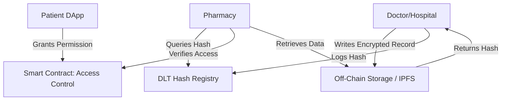

### **Blockchain in Healthcare: Prescriptions, Patient Records, and Pharmacy Interchange**

#### **Motivation**

Current centralized or paper-based healthcare systems suffer from data fragmentation, security vulnerabilities, and a lack of interoperability between providers. This leads to privacy risks, administrative inefficiencies, and resource waste. Furthermore, prescription fraud and the infiltration of counterfeit drugs into the supply chain pose severe risks to public health.

#### **Proposed Architecture**

* **Core Technologies:**
  * **Smart Contract Platform:** Permissioned ledgers (e.g., Hyperledger Fabric, R3 Corda) for privacy-sensitive consortium workloads, with optional public-chain anchoring (e.g., Polygon) for tamper-evident audit hashes.
  * **Off-Chain Storage:** IPFS or an encrypted, access-controlled object store for documents — kept off the main chain to preserve privacy and scalability and to keep PHI deletable.
  * **Identity Management:** Self-Sovereign Identity (SSI) using W3C Verifiable Credentials (VCs) and Decentralized Identifiers (DIDs) for patients and providers.
* **Workflow:**
  * **Access Control:** Patients control their own data via a DApp; hospitals and pharmacies authenticate by presenting VCs that the access-control contract validates.
  * **Data Integrity:** Prescriptions and health records are encrypted and stored off-chain; only the cryptographic hash (and access-policy metadata) is logged on-chain.
  * **Traceability:** All access requests, edits and transfers are time-stamped and signed; the log is append-only and replayable for audit.
  * **Supply Chain:** Cold-chain conditions and drug origins are tracked through signed events submitted by IoT-enabled oracles (DSCSA-aligned for the US, EU FMD-aligned for the EU).

#### **Data Flow Diagram**

```mermaid
graph TD
    User[Patient DApp] -->|Grants Permission| SC[Smart Contract: Access Control]
    Doc[Doctor/Hospital] -->|Writes Encrypted Record| IPFS[Off-Chain Storage / IPFS]
    IPFS -->|Returns Hash| Doc
    Doc -->|Logs Hash| Registry[DLT Hash Registry]
    Pharm[Pharmacy] -->|Queries Hash| Registry
    Pharm -->|Verifies Access| SC
    Pharm -->|Retrieves Data| IPFS

```

#### **Architectural Principles**

Healthcare applications demand strict adherence to data integrity, privacy, and auditability:

* **Decentralized Off-Chain Storage:** To preserve privacy and scalability, **Protected Health Information (PHI)** is encrypted and stored off-chain. Only access-control logic and cryptographic hashes reside on the ledger; this also keeps PHI legally deletable under GDPR.
* **Interoperable, Permissioned DLT:** Frameworks such as **Hyperledger Fabric** and **R3 Corda** are preferred for multi-party networks (hospitals, pharmacies, regulators). Published benchmarks show throughput well above 1 000 tx/s on tuned Fabric deployments (results vary with consensus, endorsement policy and hardware); both platforms offer low energy use and granular privacy controls suitable for GDPR / HIPAA-aligned designs.
* **Zero-Knowledge Proofs (ZKP):** Enable selective disclosure — for example, proving "patient is over 18" or "insurance policy P is valid for service S" without revealing the patient's identity or the policy contents.

#### **Example Data Flow**

1. **Record Creation:** The hospital generates an Electronic Health Record (EHR), encrypts it, stores it on IPFS, and logs the pointer hash on the DLT.
2. **Sharing/Access Request:** A patient or provider requests access; the smart contract verifies their DID and permissions.
3. **Pharmacy Fulfillment:** The pharmacy validates the prescription hash against the blockchain registry to prevent double-dispensing, then logs the fulfillment.
4. **Regulatory Audit:** Regulators use ZK-proofs to verify compliance (e.g., controlled substance tracking) without accessing raw patient identities.

**Performance Targets (indicative):**

* **Speed:** Sub-second response for record-access requests under nominal load.
* **Throughput:** >1 000 tx/s on tuned Hyperledger Fabric deployments — exact numbers depend on consensus, endorsement policy, and node hardware and should be re-measured per environment.
* **Auditability:** Append-only signed history of every access, edit and transfer.

#### **Sustainability and Societal Impact**

* **Operational Efficiency:** Reduces redundant testing and manual administrative paperwork.
* **Compliance:** Designed to support GDPR / HIPAA via cryptographic access controls, off-chain PHI, and deletable-payload patterns. (Full regulatory compliance always also requires organisational, contractual and operational controls outside the ledger.)
* **Safety:** Strengthens anti-counterfeit defenses through end-to-end traceability and tamper-evident events (DSCSA in the US, EU FMD in the EU).
* **Environmental:** Reduces logistics waste and paper-based administrative footprints.

#### **Real-World Case Studies**

* **MediLedger Network (US):** Industry consortium (originally built by Chronicled with pharma partners) running pharmaceutical traceability and verification services aligned with DSCSA on Hyperledger Fabric. As of late 2024, the **National Association of Boards of Pharmacy (NABP) acquired Chronicled's Product Verification System (PVS)** and integrates it into their *Pulse by NABP* product; MediLedger reports processing in the order of 1.6B transactions per year across ~27 manufacturers and ~18 distributors.
* **EU FMD / EMVS:** The European Medicines Verification System provides end-to-end serialised pack verification across EU member states; a frequent integration target for any EU-facing pharma chain.
* **Guardtime KSI for e-Estonia health data integrity:** Estonia's national health information systems use Guardtime's Keyless Signature Infrastructure (a hash-based integrity service) to cryptographically protect health record changes. (Note: this is distinct from the "Estcoin" digital-currency proposal, which was never launched.)
* **Medicalchain (UK):** An early reference design for patient-controlled EHR using blockchain — useful as a published architecture reference even where the original product is no longer active.

#### **Suitable Ledgers**

* **Private/Permissioned:** Hyperledger Fabric, R3 Corda (Ideal for hospital consortia and private records).
* **Public/Hybrid:** Ethereum/Polygon (Ideal for public verification of credentials or non-sensitive supply chain transparency).

#### **References**

* [W3C Decentralized Identifiers (DIDs) 1.0](https://www.w3.org/TR/did-core/)
* [W3C Verifiable Credentials Data Model](https://www.w3.org/TR/vc-data-model/)
* [HL7 FHIR R5](https://hl7.org/fhir/) — clinical data interchange standard used for the off-chain EHR payloads referenced from the ledger.
* [US Drug Supply Chain Security Act (DSCSA)](https://www.fda.gov/drugs/drug-supply-chain-integrity/drug-supply-chain-security-act-dscsa)
* [EU Falsified Medicines Directive (FMD) and EMVS](https://emvo-medicines.eu/)
* [Blockchain-Assisted Technologies for Sustainable Healthcare System (Springer 2025)](https://link.springer.com/book/10.1007/978-981-96-3928-1)
* [Digital Twin & Blockchain for Healthcare 5.0 (CRC, 2025)](https://www.taylorfrancis.com/books/edit/10.1201/9781003532286/digital-twin-blockchain-sustainable-healthcare-5-0-monica-gahlawat-sudeep-tanwar)
* [Frontiers in Public Health: Blockchain applications in healthcare](https://www.frontiersin.org/journals/public-health/articles/10.3389/fpubh.2023.1229386/full)

#### **Sustainability-First Consensus (SFC) Compliance**

Conforms to the [Sustainability-First Consensus profile v1.1](../SFC_COMPLIANCE.md) applying the framework defined in Besleaga (2026), [doi:10.1145/3809296](https://doi.org/10.1145/3809296) *(in press)*, [ORCID 0009-0001-3464-5283](https://orcid.org/0009-0001-3464-5283):

* **Energy (criterion 1).** Hot path on **Hyperledger Fabric** (HSM-bound institutional keys, general-purpose servers); daily Merkle anchor on **Polygon zkEVM**. Total measured energy < **1 GWh / yr** network-wide.
* **Hardware lifecycle (criterion 2).** No ASICs; peers on general-purpose servers; per-operator `nodeProfile` declares purchase / retirement / WEEE-certified reuse.
* **Carbon accountability (criterion 3).** Monthly `EnergyAttested` + `CarbonAttested` events per institution; Net Zero per period enforced.
* **Regulatory readiness (criterion 4).** Sustainability API returns CSRD / ESRS E1 disclosures — relevant to hospital groups and pharma manufacturers under CSRD reporting obligations.

#### **Companion Documents**

* [PRD.md](PRD.md) — Product Requirements.
* [SPEC.md](SPEC.md) — Technical Specification (data model, events, APIs, crypto).
* [ARCH.md](ARCH.md) — Architecture (components, trust boundaries, deployment).
* [../SFC_COMPLIANCE.md](../SFC_COMPLIANCE.md) — Shared Sustainability-First Consensus profile.

---
