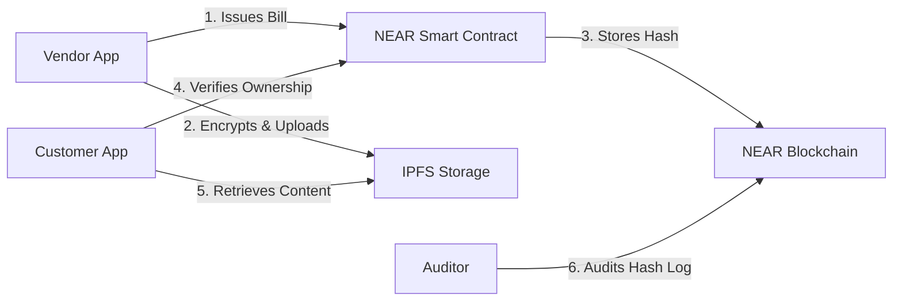

### **Blockchain-Based Billing Solution to Eliminate Paper Usage**

#### **Motivation**

The environmental cost of paper billing—16 billion receipts and invoices printed daily—is substantial, driving deforestation, water consumption, and landfill waste. Additionally, thermal paper receipts often contain harmful chemicals like BPA. While digital alternatives exist, they often suffer from fragmentation, lack of interoperability, and susceptibility to fraud. Blockchain offers a unified, tamper-proof standard for digital receipts.

#### **Proposed Architecture**

* **Core Technologies:**
* **Layer-1 Blockchain:** NEAR Protocol (Chosen for its sharding capabilities, low fees, and certified carbon-neutral Proof-of-Stake consensus).
* **Smart Contracts:** Rust/WASM-based logic for invoicing rules.
* **Storage Layer:** IPFS (InterPlanetary File System) for decentralized, content-addressed storage of bill data.

* **Workflow:**
* **Authentication:** Vendors and customers authenticate via NEAR wallets (or managed wallets for seamless UX).
* **Issuance:** The vendor generates a bill; the data is encrypted and pinned to IPFS.
* **Validation:** A hash (fingerprint) of the bill is committed to the NEAR blockchain via smart contract.
* **Access:** Customers retrieve bills via their wallet; regulators can audit transactions via the immutable ledger without accessing sensitive line-item data unless authorized.

#### **Architectural Diagram**

#### **Sustainability Impact**

* **Waste Reduction:** Directly reduces the need for thermal paper, saving trees and eliminating associated chemical waste (BPA/BPS).
* **Energy Efficiency:** NEAR Protocol is climate-neutral; its Proof-of-Stake consensus consumes negligible energy compared to traditional banking data centers or Proof-of-Work chains.
* **Longevity:** Digital receipts on decentralized storage do not fade or degrade over time like thermal paper.

#### **Policy & ESG Alignment**

* **SDG 12 (Responsible Consumption):** Directly supports sustainable management of natural resources.
* **EU Green Deal:** Aligns with mandates for digital transformation and circular economy practices.
* **Compliance:** Provides immutable audit trails for taxation authorities (e.g., VAT verification) while preserving consumer privacy via encryption.

#### **Case Study: BlockBill**

The **BlockBill** solution, developed at IIT Indore, leverages the NEAR Protocol and IPFS to create a universal digital receipt system. It was recognized as a winner at the **World Government Summit 2023** (Global Best M-Gov Award), highlighting the viability of blockchain for public sector sustainability goals.

#### **Key Features**

* **Cost Efficiency:** Drastically lower operational costs compared to printing and distributing paper receipts.
* **Interoperability:** A unified standard that can integrate with various digital identity providers and taxation systems.
* **Fraud Prevention:** Immutable ledger entries prevent receipt tampering or "double-spending" for expense claims.

**References:**

* [BlockBill Paperless Billing Solution (IIT Indore)](https://www.iiconsortium.org/wp-content/uploads/sites/2/2023/04/JOI-20230426-BlockBill-Paperless-Billing-Solution.pdf)
* [BlockBill Article - Gulf News](https://gulfnews.com/uae/government/meet-the-indian-students-who-won-dh1-million-award-at-world-government-summit-2023-in-dubai-1.93826431)

---
