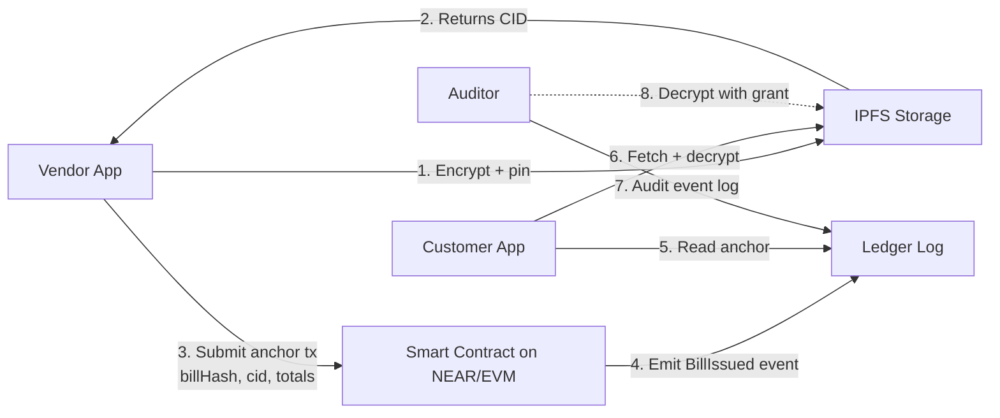

### **Blockchain-Based Billing Solution to Eliminate Paper Usage**

#### **Motivation**

Paper billing has a real environmental cost. Green America's *Skip the Slip* research estimates **over 300 billion paper receipts are produced globally each year** — in the US alone roughly **10 billion receipts per year** consume an estimated 3.68 million trees and 10 billion gallons of water, and most thermal-paper receipts cannot be recycled because they are coated with bisphenols (BPA / BPS). On the B2B side, EU regulators are moving in the same direction: the **EU "VAT in the Digital Age" (ViDA)** package (published 25 March 2025) makes e-invoicing the default for cross-border B2B transactions inside the EU. Existing digital alternatives, however, are fragmented, hard to verify across vendors, and easy to spoof on the consumer side. A ledger-anchored receipt gives every party — vendor, customer, regulator — a single tamper-evident reference.

#### **Proposed Architecture**

> The reference instantiation below mirrors the **BlockBill** case study (NEAR Protocol + IPFS). The design is platform-agnostic: any chain with low fees and standardised wallets (e.g., NEAR, Polygon PoS, an EVM L2) plus any content-addressed store (IPFS, S3-compatible with content hashing) can host the same logic.

* **Core Technologies:**
  * **Layer-1 / L2 Blockchain:** Reference choice is **NEAR Protocol** — sharded PoS, low fees, and the [first Layer-1 to receive a *Climate Neutral Product* label](https://near.foundation/blog/near-climate-neutral-product/) (South Pole assessment, 2021). EVM L2s are an equally valid substrate.
  * **Smart Contracts:** Rust / WASM on NEAR, or Solidity 0.8.x on an EVM target — implementing the receipt-anchor logic.
  * **Storage Layer:** IPFS (or any content-addressed store) for encrypted bill payloads; only the CID and a hash commit are written on-chain.
* **Workflow:**
  * **Authentication:** Vendors and customers authenticate via their native wallets (NEAR named-accounts or EVM EOAs); managed wallets are supported for non-crypto-native users.
  * **Issuance:** The vendor generates a bill formatted to a shared schema (Peppol BIS / EN 16931 for B2B; a compact JSON for B2C), encrypts the payload, pins it to IPFS, and submits a transaction containing `(billHash, cid, partyDids, totals, taxCommit)`.
  * **Validation:** The smart contract records the anchor event, enforces uniqueness, and emits a `BillIssued` event consumable by accounting and tax systems.
  * **Access:** Customers retrieve their bills through their wallet; regulators audit via the on-chain event log. Line-item data stays encrypted off-chain and is released to the regulator only through a signed consent grant (or, where law mandates, a regulator-held decryption key).

#### **Architectural Diagram**

```mermaid
graph LR
    Vendor[Vendor App] -->|1. Encrypt + pin| IPFS[IPFS Storage]
    IPFS -->|2. Returns CID| Vendor
    Vendor -->|3. Submit anchor tx<br/>billHash, cid, totals| SC[Smart Contract on NEAR/EVM]
    SC -->|4. Emit BillIssued event| Ledger[Ledger Log]
    Customer[Customer App] -->|5. Read anchor| Ledger
    Customer -->|6. Fetch + decrypt| IPFS
    Regulator[Auditor] -->|7. Audit event log| Ledger
    Regulator -.->|8. Decrypt with grant| IPFS
```

#### **Sustainability Impact**

* **Waste Reduction:** Removes thermal-paper receipts (typically BPA/BPS-coated and not recyclable) where the customer accepts a digital alternative.
* **Energy Efficiency:** A PoS blockchain such as NEAR has a published carbon-neutral certification (South Pole, 2021) and consumes orders of magnitude less energy per transaction than Proof-of-Work chains.
* **Longevity:** Content-addressed storage preserves the bill indefinitely without thermal fade, and the on-chain hash anchors its integrity.

#### **Policy & ESG Alignment**

* **SDG 12 (Responsible Consumption and Production):** Supports sustainable management of natural resources.
* **EU Green Deal & ViDA:** Aligned with the EU's e-invoicing default for cross-border B2B trade and with the circular-economy direction of the Green Deal.
* **Tax & Audit Compliance:** Provides a tamper-evident audit trail for VAT / sales-tax authorities; line-item data stays encrypted unless a regulator presents a valid access grant (or, in jurisdictions that mandate it, holds a regulator-side decryption key).

#### **Case Study: BlockBill (IIT Indore)**

**BlockBill**, conceived by Associate Professor Gourinath Banda and three IIT Indore BTech students (Bhoomil Sanjaykumar Gohel, Neel Kalpeshbhai Parikh, Niyati Totala), won the **Global Best m-Gov Award** at the **World Government Summit 2023** in Dubai (13–15 February 2023) — receiving a Dh1 million / ~Rs 2 crore prize from the Egyptian President. The IIC paper describes the system as a blockchain-based digital receipt framework for FMCG B2B/B2C; the specific NEAR + IPFS instantiation referenced above follows that published architecture. (News-side reporting confirms the award and the product concept; deeper technical claims come from the linked IIC paper.)

#### **Key Features**

* **Cost Efficiency:** Drastically lower operational costs compared to printing and distributing paper receipts.
* **Interoperability:** A unified standard that can integrate with various digital identity providers and taxation systems.
* **Fraud Prevention:** Immutable ledger entries prevent receipt tampering or "double-spending" for expense claims.

**References:**

* [BlockBill Paperless Billing Solution — IIC Journal of Innovation (PDF)](https://www.iiconsortium.org/wp-content/uploads/sites/2/2023/04/JOI-20230426-BlockBill-Paperless-Billing-Solution.pdf)
* [IIT Indore wins Global Best m-Gov Award at WGS 2023 (Free Press Journal)](https://www.freepressjournal.in/indore/iit-indore-wins-global-best-m-gov-award-at-the-world-government-summit-2023)
* [BlockBill at World Government Summit 2023 (Gulf News)](https://gulfnews.com/uae/government/meet-the-indian-students-who-won-dh1-million-award-at-world-government-summit-2023-in-dubai-1.93826431)
* [NEAR Protocol Awarded the Climate Neutral Product Label (NEAR Foundation)](https://near.foundation/blog/near-climate-neutral-product/)
* [Green America — Skip the Slip (paper-receipt impact)](https://reports.greenamerica.org/skip-the-slip)
* [EU VAT in the Digital Age (ViDA)](https://finance.ec.europa.eu/taxation/vat/vat-digital-age-vida_en)
* [Peppol BIS Billing 3.0 / EN 16931](https://docs.peppol.eu/poacc/billing/3.0/)
* [IEEE Std 2142.1 — Recommended Practice for E-Invoice Business Using Blockchain](https://standards.ieee.org/ieee/2142.1/10643/)

#### **Sustainability-First Consensus (SFC) Compliance**

Conforms to the [Sustainability-First Consensus profile v1.1](../SFC_COMPLIANCE.md) applying the framework defined in Besleaga (2026), [doi:10.1145/3809296](https://doi.org/10.1145/3809296) *(in press)*, [ORCID 0009-0001-3464-5283](https://orcid.org/0009-0001-3464-5283):

* **Energy (criterion 1).** Hot path on **NEAR Protocol** — sharded PoS, certified Climate-Neutral Product (South Pole, 2021), measured network energy is far below the SFC 1 GWh / yr cap. Per-receipt amortised on-chain energy negligible.
* **Hardware lifecycle (criterion 2).** No ASICs anywhere; NEAR validators run general-purpose servers. Project gateways run on standard cloud VMs. Hardware reuse / WEEE-certified recycling policy required for self-hosted gateways.
* **Carbon accountability (criterion 3).** Gateway operators publish monthly `EnergyAttested` + `CarbonAttested` for the gateway tier (chain-side energy is reported by the NEAR Foundation per their public certification). Net Zero invariant enforced per period.
* **Regulatory readiness (criterion 4).** `/v1/sustainability/csrd` returns signed ESRS E1 disclosures; CSRD-in-scope retailers can ingest the project's footprint as a Scope-3 input alongside their own receipts.

#### **Companion Documents**

* [PRD.md](PRD.md) — Product Requirements.
* [SPEC.md](SPEC.md) — Technical Specification (data model, anchor schema, APIs).
* [ARCH.md](ARCH.md) — Architecture (components, trust boundaries, deployment).
* [../SFC_COMPLIANCE.md](../SFC_COMPLIANCE.md) — Shared Sustainability-First Consensus profile.

---
