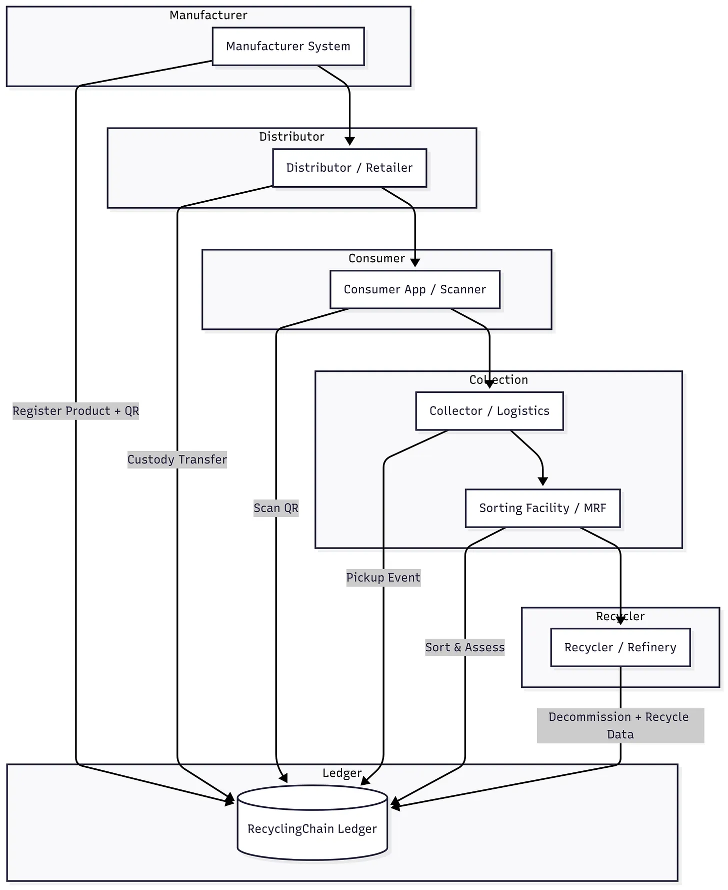
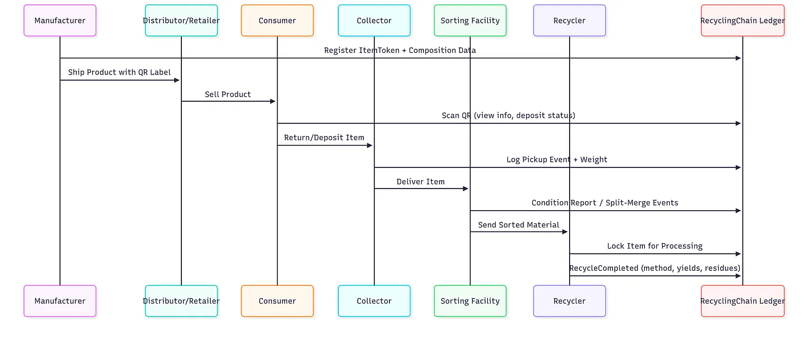
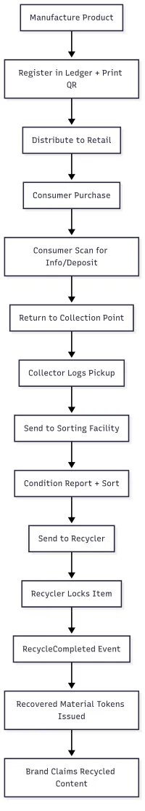
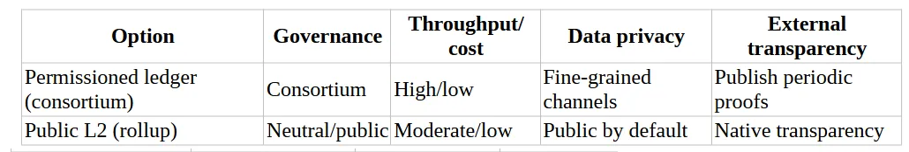

## **RecyclingChain: A Ledger-Backed Traceability System for Product End-of-Life**

We need a system that is real and accountable: a product shouldn’t just disappear into a bin with a vague promise of sustainability. RecyclingChain captures each item’s story from birth to rebirth—verifiable, tamper-evident, and auditable.

### **Objectives and Scope**

* **Traceability:** End-to-end provenance from manufacturing registration to final decommission and recycling outcome.
* **Auditability:** Immutable lifecycle events with signed attestations by each handler.
* **Fraud Resistance:** Anti-tamper labels, cryptographic signatures, and double-spend prevention for decommission events.
* **Privacy by Design:** Public verifiability of facts, with sensitive data stored off-chain and selectively disclosed.
* **Interoperability:** Standards-aligned identifiers (GS1/EPCIS) and exportable attestations for regulators and EPR reporting.
* **Scalability:** Support for item-level (high value) and batch-level (commodities) tracking, with merge/split events.



### **Participants and Roles**

* **Manufacturers (OEMs):** Register items/batches at birth; bind labels; publish composition and EPR metadata.
* **Distributors/Retailers:** Record custody transfers; optionally trigger consumer incentives at the point of sale.
* **Consumers:** Scan labels for guidance; optionally initiate take-back/deposit returns.
* **Collectors/Logistics:** Record pickup, weigh-in, and custody changes; claim collection bounties.
* **MRFs (Material Recovery Facilities):** Sort and assess condition; emit split/merge events and contamination rates.
* **Recyclers/Refiners:** Perform decommission; publish recycling type, recovery yields, and residues.
* **Auditors/Regulators:** Verify attestations; run analytics; export compliance reports.
* **Oracle Operators:** Bridge trusted hardware measurements (e.g., smart scales, chemical assays) into the ledger.

### **Data Model and Identifiers**

* **ItemToken (Non-Fungible):** Represents a single high-value product/asset.
  * **Core fields:** `itemId` (DID/URN), `manufacturerId`, `model`, `serial`, `manufactureDate`, `composition`.
  * **State:** `currentOwner`, `custodyStatus`, `locationHint`, `lifecycleStage`.
* **BatchToken (Semi-Fungible):** For lots (e.g., plastic bottles); supports split/merge operations.
* **MaterialToken (Fungible):** Represents recovered material outputs (e.g., rPET flakes, recycled copper). Enables proof of recycled content claims.

**Event Types (Append-Only):**

1. **ManufactureRegistered:** Birth record + label binding.
2. **CustodyTransferred:** Actor-to-actor handoff with signed receipt.
3. **ConditionReported:** State-of-health, contamination, weight assessment.
4. **DecommissionRequested:** Item arrives at recycler; asset locked for processing.
5. **RecycleCompleted:** Irreversible outcome; method, yields, and residues logged.

### **Lifecycle and Workflows**



#### **1. Birth and Label Binding**

* **Register Item:** Manufacturer mints ItemToken with composition and EPR metadata.
* **Print & Bind:** Secure QR (or NFC) printed with `itemId` and a manufacturer signature.

#### **2. Custody and Consumer Phase**

* **Transfer Events:** Distributor and retailer sign custody transfers to maintain continuity.
* **Consumer Scans:** Public portal shows repair/reuse options and nearest take-back points.

#### **3. Collection and Pre-processing**

* **Pickup Event:** Collector logs pickup, weight, and photo-proof; item moves to MRF.
* **Sort & Assess:** MRF emits `ConditionReported`; may execute Split/Merge transactions to create homogeneous waste streams.

#### **4. Decommission and Recycling**

* **Lock for Processing:** Recycler emits `DecommissionRequested` to prevent the asset from being "recycled" twice (double-spending).
* **RecycleCompleted:** Final, signed attestation containing:
  * **Method:** (e.g., mechanical, pyrometallurgical).
  * **Yields:** % by material; links to newly minted MaterialTokens.
  * **Residues:** Hazardous outputs and their legal disposition.

#### **5. Recycled Content and Claims**



* **Mint MaterialTokens:** Trace recovered materials with provenance back to source ItemTokens.
* **Redeem/Retire:** Brands buy and burn MaterialTokens to substantiate recycled content claims in new packaging.

### **Architecture and Smart Contracts**

* **Deployment Pattern:** Hybrid approach. A **Permissioned Core** (Hyperledger/Corda) allows for industry governance and high throughput, while **Public Proofs** (Ethereum L2/Polygon) are anchored periodically for consumer transparency and trust.



* **Core Contracts/Services:**
  * **Registry:** Participant onboarding, roles (RBAC), and DID resolution.
  * **Token Contracts:** ERC-like interfaces with restricted mint/burn logic.
  * **Lockbox:** Prevents concurrent decommission or duplicate recycling claims.
  * **RewardsVault:** Handles deposits (DRS), bounties, and eco-credits.
  * **Oracle Adapters:** Interfaces for verifiable inputs (IoT scales, spectrometers).


### **QR/NFC Label Design**

* **Data Minimization:** Encode only a resolvable identifier and a short signed payload; do not pack PII or heavy metadata into the code.
* **Offline Verification:** The Manufacturer-signed payload allows basic authenticity checks without internet access.

**Example QR Payload** (base64url-encoded JSON inside a short URI):
`recy://i/RC-RO-ARG-2025-000123?d=eyJpZ...&sig=MEUCIQDPc4...&alg=Ed25519`

**Canonical JSON Fields:**

```jsonc
{
  "id":  "RC-RO-ARG-2025-000123",
  "mfd": "2025-08-20",
  "b":   "4B192A",         // short batch code
  "s":   "MFA298_pubkey"   // issuer key hint
}
```

* **Anti-Tamper Options:**
  * **Holographic Destruct Labels:** Physical tamper evidence if removed.
  * **Laser Etching:** Direct part marking to alleviate label-swapping risks on hard goods.
  * **NFC Secure Element:** For counterfeit-prone categories (cryptographically non-clonable).


### **Identity, Privacy, and Security**

* **Participant Identity:** DIDs with Verifiable Credentials (VCs) for role-based permissions.
* **Event Signing:** Every event is signed by the actor’s private key; the ledger verifies the signature against the Registry whitelist.
* **GDPR Alignment:** strictly no PII on-chain. Consumer interactions are pseudonymous. "Right to be forgotten" is achieved by keeping personal data off-chain.
* **Fraud Controls:**
  * **Single Decommission:** The `Lockbox` contract enforces one active decommission process per ItemID.
  * **Mass-Balance Checks:** The system flags anomalies if an MRF claims to recycle more material weight than they digitally accepted into custody.


### **Incentives and Economics**

* **Deposit-Return (DRS):** Deposit is escrowed in the RewardsVault at sale; released upon verified scan at return.
* **Collector Bounties:** Dynamic pay-per-weight bounties, adjusted by contamination score.
* **Brand Credits:** Retiring MaterialTokens generates auditable "Green Claims" for marketing compliance (EU Green Claims Directive).

### **KPIs and Reporting**

* **Traceability Coverage:** % of items registered vs. % reaching a terminal event.
* **True Recycling Rate:** Share of items with valid `RecycleCompleted` events vs. total sold.
* **Time-to-Decommission:** Median days from consumer discard to material recovery.
* **Counterfeit Rate:** Detected anomalies (duplicate scans/invalid locations) per 10k scans.

### **Risks and Mitigations**

* **Label Tampering:** Use destruct labels and anomaly detection algorithms. *Mitigation:* Laser printing directly onto products can prevent label swapping.
* **Data Quality Inflation:** "Garbage in, garbage out." *Mitigation:* Require photo proofs, IoT weight integration, and reputation-staking for high-volume actors.
* **Throughput/Cost:** *Mitigation:* Use batch-level tracking for low-value items and use Zero-Knowledge Rollups (ZKRs) to compress transaction data.

### **Open Decisions**

* **Network Model:** Consortium vs. Public Layer 2 vs. Hybrid.
* **Deposit Logic:** Who receives the unclaimed deposits (the system, the state, or a green fund)?
* **Data Schema:** Alignment with the EU Digital Product Passport (DPP) standards.

### **Sustainability-First Consensus (SFC) Compliance**

RecyclingChain is designed to satisfy all four [SFC criteria](../SFC_COMPLIANCE.md) defined in Besleaga (2026), [doi:10.1145/3809296](https://doi.org/10.1145/3809296), [ORCID 0009-0001-3464-5283](https://orcid.org/0009-0001-3464-5283):

* **Energy (criterion 1).** Hot-path on **Hyperledger Fabric** (consortium BFT, general-purpose servers). Daily Merkle anchor on **Polygon zkEVM**. Combined measured energy budget < **1 GWh / yr** network-wide.
* **Hardware lifecycle (criterion 2).** Every peer node runs on general-purpose x86 / arm64 servers; no ASICs anywhere in the design. Hardware reuse / WEEE-recycling policy mandatory in every operator's Registry record.
* **Carbon accountability (criterion 3).** Operators publish monthly `EnergyAttested` + `CarbonAttested` events ([SFC_COMPLIANCE.md §4](../SFC_COMPLIANCE.md)), measured via CCRI methodology + Electricity Maps grid intensity. Net Zero invariant `scope2 + scope3 ≤ offsets` checked by the verifier.
* **Regulatory readiness (criterion 4).** Sustainability API (`/v1/sustainability/*`) returns signed CSRD / ESRS E1 disclosures.

### **Companion Documents**

* [PRD.md](PRD.md) — Product Requirements Document.
* [SPEC.md](SPEC.md) — Technical Specification (data model, events, APIs).
* [ARCH.md](ARCH.md) — Architecture (components, deployment, trust boundaries).
* [../SFC_COMPLIANCE.md](../SFC_COMPLIANCE.md) — Shared Sustainability-First Consensus profile.

---
