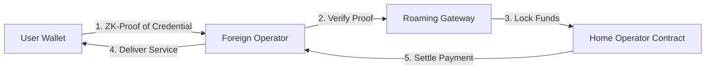

### **Unified Blockchain Roaming: Telecom, EV Charging, and Utilities**

#### **Motivation**

Sectors like telecommunications and electric vehicle (EV) charging face significant hurdles in offering seamless, cross-border "roaming." Current systems suffer from fragmented identity standards, high reconciliation costs, billing errors, and fraud. A unified, blockchain-based interoperability layer can eliminate duplicate registrations and enable instant, trusted settlements between operators across different countries.

#### **Proposed Architecture**

* **Identity Layer (SSI):** Users (drivers, subscribers) are issued Decentralized Identifiers (DIDs) and Verifiable Credentials (VCs) compliant with W3C standards.
* **Settlement Layer (Permissioned DLT):**
* **Hyperledger Indy:** Specialized for managing secure digital identities.
* **Hyperledger Fabric / Hedera:** Public-permissioned ledgers for handling high-volume transaction settlements between operators.

* **Interoperability Bridge:** A "Roaming Gateway" that bridges sectoral DLTs (e.g., connecting an EV network on Cosmos to a Telecom network on Ethereum) using protocols like **IBC (Inter-Blockchain Communication)** or **CCIP**.
* **Smart Contracts:** Automate Service Level Agreements (SLAs), instant billing settlement, and govern user consent for data sharing.
* **Privacy Layer:** Utilizes **Zero-Knowledge Proofs (ZKPs)** to prove a user's creditworthiness or subscription status without revealing their personal identity.

#### **Data Flow & Logic**

1. **User Onboarding:** The user creates a DID stored in a mobile wallet. The "Home Operator" (e.g., T-Mobile or Shell Recharge) issues a Verifiable Credential (VC) attesting to the user's plan and payment status.
2. **Roaming Request:** The user attempts to connect to a "Foreign Operator" (e.g., a charger in France). The wallet generates a ZK-Proof confirming valid subscription status.
3. **Verification & Access:** The Foreign Operator's system verifies the proof on-chain via the Roaming Gateway. Access is granted instantly (latency <2s).
4. **Automated Settlement:** Smart contracts log usage (data consumed or kWh charged) and trigger an automatic micro-settlement between the Home and Foreign operators.
5. **ESG Compliance:** The transaction log includes standardized tags for CO₂ emissions and renewable energy usage, automating CBAM and CSRD reporting.

#### **Scalability and Privacy**

* **Performance:** Modern BFT (Byzantine Fault Tolerance) or Hashgraph consensus ensures cross-chain operations occur with 1–2 second latency.
* **Privacy by Design:** "Data minimization" principles are enforced by smart contracts; only essential data is shared for billing, protecting user location and habits.
* **Regulatory Alignment:** The architecture natively supports EU-GDPR (Right to be Forgotten via off-chain data storage) and sector-specific interoperability mandates.

#### **Ecological and Policy Impact**

* **Unified Identity:** A single digital ID works across sectors, eliminating redundant paperwork and plastic cards.
* **Green Tracking:** Integrated renewable energy provenance ensures "green charging" claims are auditable.
* **Fraud Reduction:** Shared immutable ledgers prevent double-billing and "sim-box" fraud in telecom.

#### **Ledger Suitability**

* **Identity:** **Hyperledger Indy** or **Sovrin** (Purpose-built for SSI).
* **Settlement:** **Hyperledger Fabric** (Private channels for operator privacy) or **Hedera Hashgraph** (High throughput for micro-transactions).

**References:**

* [GSMA - Blockchain for Inter-Operator Roaming](https://www.gsma.com/solutions-and-impact/industry-services/blog/how-blockchain-can-speed-up-inter-operator-settlement/)
* [BlockRoam: Blockchain-based Roaming Management System](https://arxiv.org/pdf/2005.04571v1)

---
