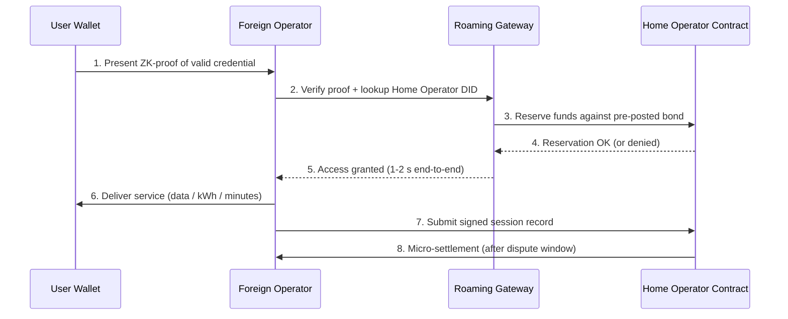

### **Unified Blockchain Roaming: Telecom, EV Charging, and Utilities**

#### **Motivation**

Telecommunications and electric-vehicle (EV) charging both rely on **roaming**: a subscriber of one operator using another operator's network. Today this is handled by sector-specific clearing houses — IPX / TADIG processes in telecom, **OCPI** (Open Charge Point Interface) hub-and-spoke contracts in EV charging — each with its own onboarding, reconciliation cycle (often days to months) and fraud surface. The work below proposes a **shared identity + settlement layer on a permissioned ledger** that does **not replace** OCPI / OCPP or GSMA roaming agreements but augments them with near-real-time settlement, cryptographic identity, and a single source of truth that reduces reconciliation cost and disputes.

> **Industry context.** GSMA already operates a Hyperledger Fabric–based **eBusiness Network** (launched 2021) for wholesale-roaming clearing and settlement; in EV charging, **OCPI** (managed by the EVRoaming Foundation) is the de-facto roaming standard while **OCPP** (Open Charge Alliance, IEC 63584) governs charger ↔ backend communication. This design integrates *with* those, not against them.

#### **Proposed Architecture**

* **Identity Layer (SSI):** Users (drivers, telecom subscribers) hold **Decentralized Identifiers (DIDs)** and **Verifiable Credentials (VCs)** issued by their Home Operator, following W3C DID Core and VC Data Model 2.0. The credential carries the minimum facts needed for service (plan tier, fair-use limits, creditworthiness flag) — not the user's full identity.
* **Settlement Layer (Permissioned DLT):**
  * **Hyperledger Indy / Aries** (or any W3C-DID-compatible network) for the SSI substrate.
  * **Hyperledger Fabric** or **Hedera** for the inter-operator settlement ledger — both have published throughput well above what roaming flows require and offer the privacy controls operators need.
* **Interoperability Bridge ("Roaming Gateway"):** A relay between sector DLTs and between DLT and the legacy world. Where both sides are blockchains, **IBC** (Cosmos-style) is appropriate for native chain-to-chain messaging and **CCIP** (Chainlink) for EVM-to-EVM with a shared oracle layer. Where one side is OCPI/OCPP or a telecom IPX, the gateway exposes a standards-aligned adapter rather than forcing the legacy side to "be on chain".
* **Smart Contracts:** Encode the inter-operator agreement: tariffs, fair-use thresholds, dispute windows, automatic micro-settlement on usage, and consent rules for any data sharing beyond settlement.
* **Privacy Layer:** **Zero-Knowledge Proofs** for selective disclosure — e.g., "this driver has a valid contract with a Registry-listed Home Operator and has sufficient credit for this session" — without revealing the driver's identity or contract details to the Foreign Operator.

#### **Data Flow & Logic**

1. **User Onboarding:** The user creates a DID stored in a mobile wallet. The **Home Operator** (e.g., a mobile network operator, an eMSP, or a utility) issues a Verifiable Credential attesting to the user's plan, fair-use limit and a creditworthiness flag.
2. **Roaming Request:** The user reaches a **Foreign Operator** (e.g., an OCPI-network EV charger in France or a visited mobile network). The wallet generates a ZK-proof confirming a valid contract with a Registry-listed Home Operator.
3. **Verification & Access:** The Foreign Operator's system verifies the proof on-chain through the Roaming Gateway. Access is granted in 1–2 s end-to-end (achievable on Fabric/Hedera-class throughput; subject to physical media latency).
4. **Automated Settlement:** Smart contracts log the session (data MB, voice minutes, kWh delivered) and trigger a micro-settlement between Home and Foreign operators against a pre-posted bond. Disputes follow a defined window before final settlement.
5. **ESG Tagging (optional):** Where the upstream operator can attest to it, the session event carries renewable-energy provenance and CO₂ intensity for downstream **CSRD** and **CBAM** reporting. Tags are advisory unless backed by a recognised attestation (e.g., a Guarantee of Origin certificate hash).

```mermaid
sequenceDiagram
    participant U as User Wallet
    participant F as Foreign Operator
    participant G as Roaming Gateway
    participant H as Home Operator Contract
    U->>F: 1. Present ZK-proof of valid credential
    F->>G: 2. Verify proof + lookup Home Operator DID
    G->>H: 3. Reserve funds against pre-posted bond
    H-->>G: 4. Reservation OK (or denied)
    G-->>F: 5. Access granted (1-2 s end-to-end)
    F->>U: 6. Deliver service (data / kWh / minutes)
    F->>H: 7. Submit signed session record
    H->>F: 8. Micro-settlement (after dispute window)
```

#### **Scalability and Privacy**

* **Performance.** Hyperledger Fabric and Hedera both deliver well above what roaming session volumes require; the practical bottleneck is the *physical* connection latency (RAN attach, OCPP `RemoteStartTransaction`), not ledger throughput. Target: < 2 s end-to-end authorisation; settlement asynchronous within minutes.
* **Privacy by design.** Only the minimum facts needed for the session are shared: which Home Operator vouches for the user, that they have credit, what is being consumed. Identity, location history and contract details stay with the Home Operator.
* **Regulatory alignment.** GDPR right-to-be-forgotten is preserved by keeping PII off-chain and using DIDs only as opaque references; the EU **Roaming Regulation 2022/612** for telecoms and **AFIR (Alternative Fuels Infrastructure Regulation)** for EV charging set the policy floor this design integrates with.

#### **Ecological and Policy Impact**

* **Unified Identity:** A single digital ID works across sectors, eliminating redundant paperwork and plastic cards.
* **Green Tracking:** Integrated renewable energy provenance ensures "green charging" claims are auditable.
* **Fraud Reduction:** Shared immutable ledgers prevent double-billing and "sim-box" fraud in telecom.

#### **Ledger Suitability**

* **Identity (SSI):** **Hyperledger Indy / Aries** or the **Sovrin Network** — both still actively maintained; either is appropriate for the DID + VC substrate.
* **Settlement:** **Hyperledger Fabric** (private channels per operator pair) or **Hedera** (high throughput + finality suited to micro-transactions).
* **Cross-chain (where genuinely needed):** **IBC** between Cosmos-SDK / Substrate ledgers; **Chainlink CCIP** between EVM ledgers. Avoid bridges where a standards-aligned adapter into OCPI / GSMA eBusiness Network is sufficient — bridges add risk, adapters reuse existing trust.

#### **Standards Touched**

* **EV charging:** [OCPI 2.2+ — Open Charge Point Interface](https://evroaming.org/ocpi-protocol) (EVRoaming Foundation) and [OCPP 2.0.1 / 2.1 — Open Charge Point Protocol](https://openchargealliance.org/protocols/open-charge-point-protocol/) (Open Charge Alliance; OCPP 2.0.1 ed3 approved as **IEC 63584** in 2024).
* **Telecom roaming:** [GSMA eBusiness Network](https://www.gsma.com/solutions-and-impact/industry-services/blog/how-blockchain-is-evolving-wholesale-roaming-processes/) (Hyperledger Fabric, in production since 2021); BCE / TADIG processes.
* **Identity:** [W3C DID Core](https://www.w3.org/TR/did-core/) and [W3C Verifiable Credentials Data Model](https://www.w3.org/TR/vc-data-model/).
* **Regulatory (EU):** [Roaming Regulation 2022/612](https://eur-lex.europa.eu/eli/reg/2022/612/oj), [AFIR](https://transport.ec.europa.eu/transport-themes/clean-transport/alternative-fuels-sustainable-mobility-europe/alternative-fuels-infrastructure_en), [CBAM](https://taxation-customs.ec.europa.eu/carbon-border-adjustment-mechanism_en), [CSRD](https://finance.ec.europa.eu/capital-markets-union-and-financial-markets/company-reporting-and-auditing/company-reporting/corporate-sustainability-reporting_en).

**References:**

* [GSMA — How blockchain is evolving wholesale roaming processes](https://www.gsma.com/solutions-and-impact/industry-services/blog/how-blockchain-is-evolving-wholesale-roaming-processes/)
* [GSMA — Blockchain for Wholesale Roaming MVP Report (PDF)](https://www.gsma.com/newsroom/wp-content/uploads/GSMA-Blockchain-for-Wholesale-Roaming-MVP-Report.pdf)
* [BlockRoam: Blockchain-based Roaming Management System (arXiv 2005.04571)](https://arxiv.org/abs/2005.04571)
* [OCPI Protocol — EVRoaming Foundation](https://evroaming.org/ocpi-protocol)
* [Chainlink CCIP](https://chain.link/cross-chain)
* [IBC Protocol](https://ibcprotocol.org/)

#### **Sustainability-First Consensus (SFC) Compliance**

Conforms to the [Sustainability-First Consensus profile v1.1](../SFC_COMPLIANCE.md) applying the framework defined in Besleaga (2026), [doi:10.1145/3809296](https://doi.org/10.1145/3809296) *(in press)*, [ORCID 0009-0001-3464-5283](https://orcid.org/0009-0001-3464-5283):

* **Energy (criterion 1).** Hot path on **Hyperledger Fabric** (aligned with the GSMA eBusiness Network) or **Hedera** (carbon-negative aBFT). Anchor on Polygon zkEVM. Combined measured energy budget < **1 GWh / yr** network-wide.
* **Hardware lifecycle (criterion 2).** General-purpose servers only; no ASICs; each Operator declares `nodeProfile` with WEEE-certified retirement.
* **Carbon accountability (criterion 3).** Monthly `EnergyAttested` + `CarbonAttested` per Operator; Net Zero invariant enforced. ESG renewable-energy tags on EV sessions are independently verifiable.
* **Regulatory readiness (criterion 4).** `/v1/sustainability/csrd` returns signed ESRS E1 disclosures — directly relevant for telecom and CPO groups under CSRD reporting and for AFIR-aligned reporting on EV charging.

#### **Companion Documents**

* [PRD.md](PRD.md) — Product Requirements.
* [SPEC.md](SPEC.md) — Technical Specification (identity, settlement events, adapters).
* [ARCH.md](ARCH.md) — Architecture (components, trust boundaries, deployment).
* [../SFC_COMPLIANCE.md](../SFC_COMPLIANCE.md) — Shared Sustainability-First Consensus profile.

---
