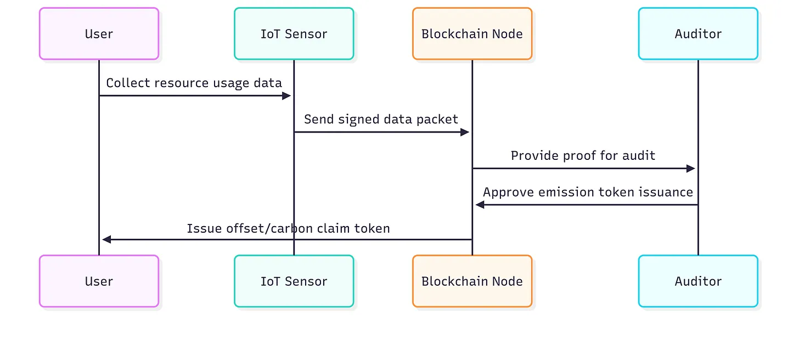

### **Novel Blockchain Applications for Climate Change and Sustainability: Proposed Innovations**

DLT-native climate platforms (e.g., **Hedera Guardian**, the [**DLT Earth**](https://www.dltearth.com/) grant program by Exponential Science and the Hedera Foundation Sustainable Impact Fund, **Toucan Protocol**, **Regen Network**, **Open Forest Protocol**, **Klima Protocol** — the renamed and re-launched successor to KlimaDAO since February 2026) enable auditable and transparent climate-finance mechanisms. Hackathons and open-source initiatives are digitising **Measurement, Reporting, and Verification (MRV)** with a strong emphasis on digital carbon-credit tokenisation, carbon-price discovery, and alignment with UN SDGs.

> This document is an idea catalogue, not a single proposed system. Each numbered section below is a candidate innovation at a different level of technical readiness — clearly labelled. The companion [PRD.md](PRD.md), [SPEC.md](SPEC.md) and [ARCH.md](ARCH.md) deliberately scope down to one minimal, implementable subset (an MRV-anchored carbon-credit registry on Hedera Guardian / Hyperledger Fabric) so that an engineering team can pick it up directly.

**Catalogue references:**

* [DLT Earth — grant program for climate-DLT projects](https://www.dltearth.com/)
* [Hedera Guardian — open-source MRV / ESG asset toolkit](https://docs.hedera.com/guardian/getting-started/guardian-overview)
* [Toucan Protocol](https://toucan.earth/)
* [Regen Network](https://www.regen.network/)
* [Open Forest Protocol](https://www.openforestprotocol.org/)
* [Klima Protocol (formerly KlimaDAO)](https://www.klimadao.finance/)
* [Verra & Hedera — digital transformation of carbon markets](https://verra.org/verra-and-hedera-to-accelerate-digital-transformation-of-carbon-markets/)

---

#### **1. Quantum-Sourced Randomness for Consensus and MRV Sampling** *(research-stage)*

> **Readiness:** active research, not production. Treat this as forward-looking design space.

Hardware quantum random number generators (QRNGs) can produce certifiably unpredictable entropy that is useful in blockchain systems for:

* **Validator / committee selection** in PoS-style consensus (instead of biased PRNGs).
* **MRV audit sampling** — picking which farms / forest plots / shipments to audit in an unbiased, auditable way.
* **Key generation** for long-lived credentials in post-quantum schemes.

* **Architecture sketch:**
  * QRNG module(s) at validator nodes or at a small set of beacon nodes (cf. the [NIST CURBy randomness beacon](https://spectrum.ieee.org/nist-quantum-random-number-generator) for a public reference).
  * Block proposer (or sample set) selected from a verifiable combination of QRNG inputs to remove single-source risk.
  * Hardware-anchored timestamps to prevent grinding attacks.

* **Open questions:** how to make QRNG outputs publicly verifiable in real time (active research at NIST / CU Boulder, see *CURBy*); how to enforce hardware attestation at validator onboarding; full quantum-resistance is a separate signature-scheme concern (NIST PQC).

#### **2. Tokenised ESG Marketplace** *(implementable today on existing infra)*

* **Core function:** Smart contracts mint, transfer and retire ESG tokens (carbon, water, biodiversity, social-impact) where the upstream attestation is itself a Verifiable Credential signed by a recognised certifier.
* **Scalability:** Use an L2 or a high-throughput permissioned ledger (Polygon zkEVM, Hedera, Hyperledger Fabric). Cross-chain bridges add risk — prefer canonical mint on one chain plus standards-aligned exports rather than cross-chain duplication.
* **Compliance:** Output formats align with the **GHG Protocol Product Standard**, **EU CSRD**, and where applicable **CBAM** disclosures.
* **Security & impact:**
  * Open read APIs for NGOs, smallholders and companies.
  * Selective-disclosure (ZK / BBS+) for sensitive supply-chain facts.
  * Pilots in circular-economy material flows.

> **Reality check.** Tokenised carbon markets have known integrity problems (e.g., the [CarbonPlan analysis of "zombie" credits bridged to chains](https://carbonplan.org/research/toucan-crypto-offsets)). Any production deployment MUST require that retired upstream credits cannot be re-listed, and MUST publish the upstream registry → on-chain mapping for any external auditor to verify.

---

#### **3. Automated Carbon Accounting and Verification**

* **Tokenisation pipelines:** Carbon-credit lifecycle (issue / transfer / retire) on platforms such as Toucan Protocol, Regen Network, Open Forest Protocol and Klima Protocol — each with a different combination of registry partners and asset profile.
* **Decentralised MRV:** IoT sensors + AI-assisted analytics + DLT anchoring. Hedera Guardian provides an open-source reference for the methodology engine and the asset issuance path.
* **Biodiversity credits:** Emerging programs (e.g., Open Forest Protocol's forest-MRV pilots; community projects on Greenstand) extend the pattern beyond carbon. Treat any specific project's status and integrity claims as time-bound — verify before referencing in production design.

#### **System Example: Hyperledger-Based Carbon Accounting**

The simplest implementable subset (what [SPEC.md](SPEC.md) and [ARCH.md](ARCH.md) describe):

* **Functionality:** Issue, transfer and retire emission / offset tokens; record supply-chain carbon transfers; let authorised auditors and regulators read the full event log (CBAM / CSRD aligned).
* **Deployment:** Hyperledger Fabric permissioned network with operator, auditor and regulator channels; optional public anchor for external integrity verification.
* **Verifiability:** Smart contracts validate emission factors and offset calculations directly against published methodologies (GHG Protocol, IPCC AR6 emission factors, EU Monitoring & Reporting Regulation values).

#### **Data Flow Diagram Example**

#### **Sustainability-First Consensus (SFC) Compliance**

Of all six projects in this catalogue, a *carbon-credit registry running on a non-SFC-compliant chain* would be the most self-defeating. This project therefore conforms strictly to the [Sustainability-First Consensus profile v1.1](../SFC_COMPLIANCE.md) applying the framework defined in Besleaga (2026), [doi:10.1145/3809296](https://doi.org/10.1145/3809296), [ORCID 0009-0001-3464-5283](https://orcid.org/0009-0001-3464-5283):

* **Energy (criterion 1).** Hot path on **Hedera with Guardian** (carbon-negative aBFT) or **Hyperledger Fabric** (consortium, general-purpose servers). Total measured energy < **1 GWh / yr** network-wide; the system's own footprint is published as part of every signed audit bundle.
* **Hardware lifecycle (criterion 2).** No ASICs; all nodes general-purpose; `nodeProfile` declared per Operator.
* **Carbon accountability (criterion 3).** Self-applies the same standards it enforces on others: monthly `EnergyAttested` + `CarbonAttested` per Operator; Net Zero per period via verified offsets. Offsets retired through this very registry where possible, closing the loop.
* **Regulatory readiness (criterion 4).** Buyer audit bundles already include CSRD / ESRS E1 climate disclosures; `/v1/sustainability/csrd` is part of the same surface.

#### **Companion Documents**

* [PRD.md](PRD.md) — Product Requirements for the minimal MRV + carbon-credit registry subset.
* [SPEC.md](SPEC.md) — Technical Specification (tokens, MRV events, APIs, methodology hooks).
* [ARCH.md](ARCH.md) — Architecture (components, trust boundaries, deployment).
* [../SFC_COMPLIANCE.md](../SFC_COMPLIANCE.md) — Shared Sustainability-First Consensus profile.

---
